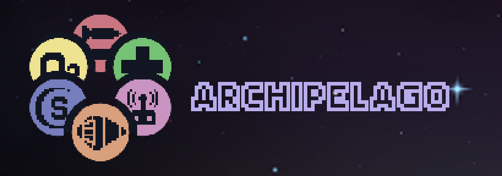
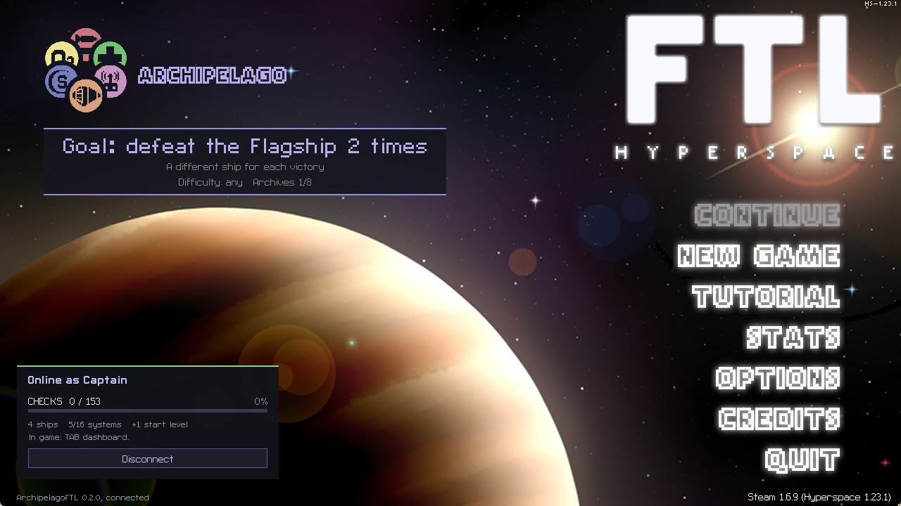
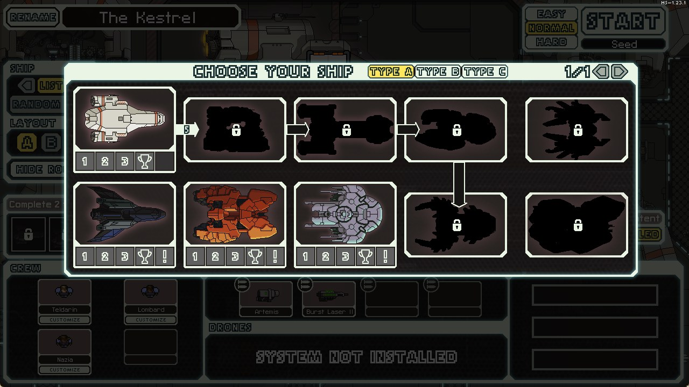
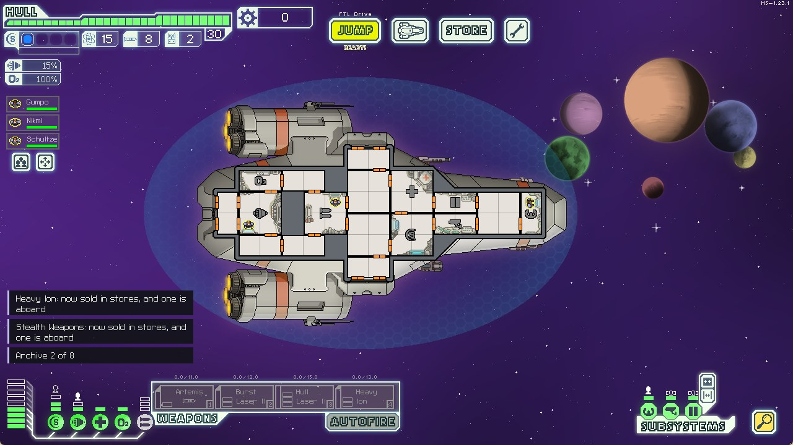
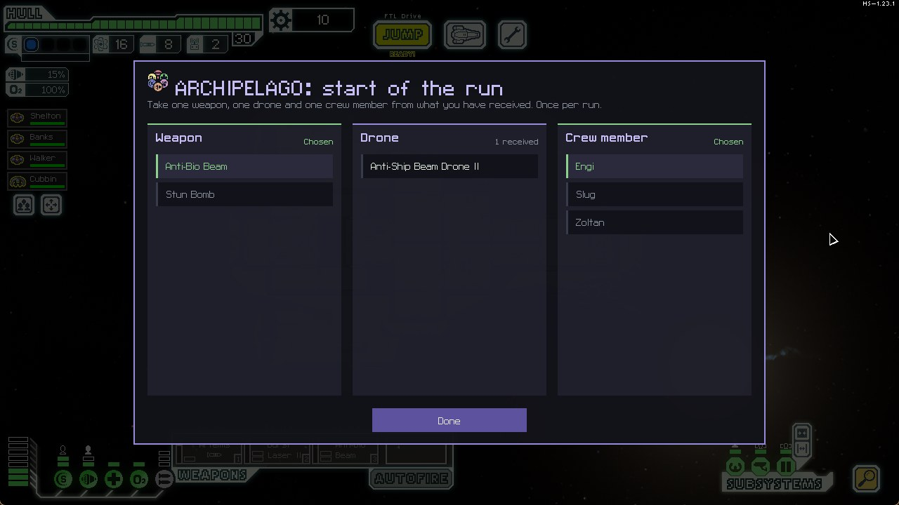
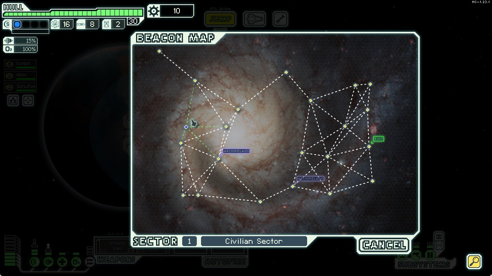
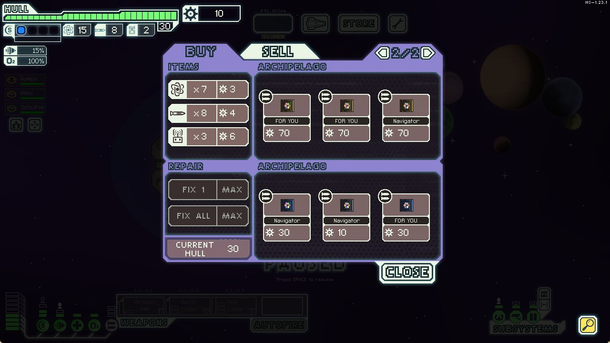
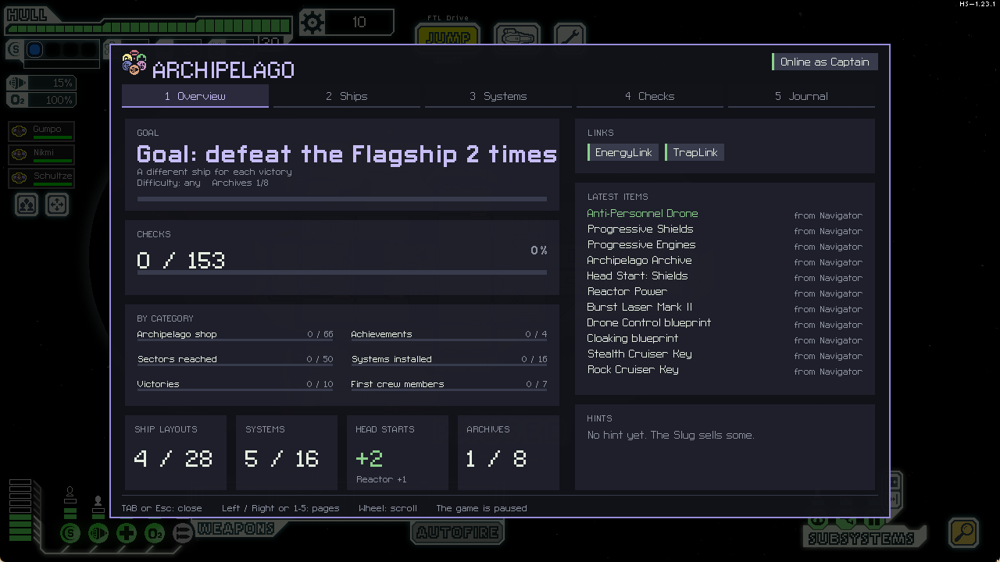

<h1 align="center">FTL Archipelago</h1>

<b>FTL: Faster Than Light</b> in an <a href="https://archipelago.gg">Archipelago</a> multiworld. 
Your ships, systems and weapons are scattered across your friends' games. Theirs are hidden in yours.

<a href="https://github.com/TheLiloji/FTLArchipelago/releases">Download</a> ·
<a href="docs/wiki/Setup-Windows.md">Setup on Windows</a> ·
<a href="docs/wiki/Setup-Linux.md">Setup on Linux</a> ·
<a href="docs/wiki/Home.md">Wiki</a>

> **Beta.** Played from start to goal on Windows and Linux. Found something odd? Open an
> [issue](https://github.com/TheLiloji/FTLArchipelago/issues) with your `FTL_HS.log`.

## How it plays

**You start with almost nothing.** One ship, few systems, and every other cruiser locked in the hangar.

**Every run you play sends items to the others.** Reaching a sector, installing a system, recruiting a new race,
earning an achievement or beating the Flagship are all checks.

**What they find for you arrives on its own.** A ship key opens a cruiser, a blueprint lets stores sell a system,
a weapon lands on your ship and shows up more in stores.

**Each new run starts stronger.** Head starts give free system levels, and the start-of-run menu lets you bring
one weapon, one drone and one crew member from everything you have collected.

**ARCHIPELAGO beacons** appear on every sector map. They hold a shop full of packages for the other players
(and some FOR YOU), or one of four small events: a relay, a Zoltan checkpoint, a Slug selling hints, a surge
from another world.

| | |
|---|---|
|  |  |

**Press `TAB`** for the dashboard: your goal, your checks, what you received and your hints.

**Traps** (if the seed has them): fire, hull breach, fuel leak, system damage, a boarding party, the rebel fleet
getting closer. They wait for a quiet beacon and can never destroy your ship on their own.

**Death Link, Energy Link, Trap Link** (optional): your deaths reach the other players and theirs hit you (a
breach and a fire by default, never enough to destroy your ship), a fuel reserve is shared with everyone, and traps travel between
games.

**Losing a run only costs the run.** Everything you received stays.

## How you win

Beat the Flagship with several **different** ships, on Normal or Hard: five by default, the seed decides. You
also need **Archives**, pieces scattered in the other players' worlds: 10 of the 12 by default.
The main menu always shows where you stand.

## Checks

| What you do | Example | How many |
|---|---|---|
| Reach a sector with a ship layout | Kestrel Cruiser A: Reach sector 5 | 8 per layout, up to 224 |
| Beat the Flagship with a layout | Engi Cruiser B: Defeat the Flagship | 1 per layout, up to 28 |
| Install a system | Install Cloaking | 16, or 68 counting every level |
| Recruit the first crew member of a race | First Zoltan aboard | 7 |
| Earn a ship achievement | Kestrel Cruiser: Full Arsenal | 30 |
| Earn a general achievement | Achievement: Technophobia | up to 21 |
| Buy a package in the Archipelago shop | Archipelago Shop 7 | 20 or more |

Your YAML decides which of these are in the seed. A short seed has around 130 checks, a long one 300 and more.

## Items

| Item | How many | What it does |
|---|---|---|
| Ship keys | 10 | unlock a cruiser (Type A) in the hangar |
| Layouts B and C | 18 | unlock the other layouts of a cruiser |
| System blueprints | 16 | stores can now sell that system |
| Progressive system upgrades | one per level | raise how far a system can be upgraded |
| Head starts | 16 | a free level of that system at the start of every run |
| Reactor Power | 8 | one more reactor bar at the start of every run |
| Weapons | 37, twice each | 1st copy: one on board and more common in stores. 2nd: in the start-of-run menu |
| Drones | 14, twice each | same as weapons |
| Augments | 23 | one on board and more common in stores |
| Crew members | 8 races | 1st: joins your run. 2nd: in the start-of-run menu. 3rd: becomes an expert |
| Archives | 0 to 50 | needed for the goal, if the seed uses them |
| Filler | | scrap, fuel, missiles, drone parts, hull repair, a new crew member |
| Traps | 7 kinds | fire, hull breach, fuel leak, system damage, hull damage, boarding party, rebel fleet |

## Getting started

1. Download `ArchipelagoFTL.ftl` and the Hyperspace library for your system from the
   [release](https://github.com/TheLiloji/FTLArchipelago/releases), then follow the setup page for
   [Windows](docs/wiki/Setup-Windows.md) or [Linux](docs/wiki/Setup-Linux.md). Both pages exist in English,
   French, German, Spanish, Italian and Portuguese: pick your language at the top.
2. Make your YAML: the default options are the recommended ones, or pick a [preset](docs/wiki/Options.md) for a
   shorter or longer game. Whoever generates the seed needs `ftl.apworld`.
3. Start FTL, type the server, the port and your slot name in the panel at the bottom left, and connect.

No server? **Solo mode** plays a real seed alone, one item per check.

More in the wiki: [playing](docs/wiki/Playing.md), [options](docs/wiki/Options.md),
[hosting a seed](docs/wiki/Hosting-a-seed.md), [FAQ](docs/wiki/FAQ.md).

## Languages

English, French, Spanish, German, Italian and Portuguese, following FTL's own language. The French text was
written by hand; the other translations were made with AI and may have mistakes, fixes are welcome.

## Credits

The first design of the items and locations comes from the [FTL Manual by Et0san](https://github.com/Et0san/Manual)
(MIT). The FTL Archipelago logo was drawn by Trapper444. Built on
[FTL: Hyperspace](https://github.com/FTL-Hyperspace/FTL-Hyperspace) (CC-BY-SA 4.0). See
`apworld/ftl/LICENSE.md` and `mod/ArchipelagoFTL/CREDITS.md`.

Building from source and running the tests: [docs/BUILDING.md](docs/BUILDING.md).
