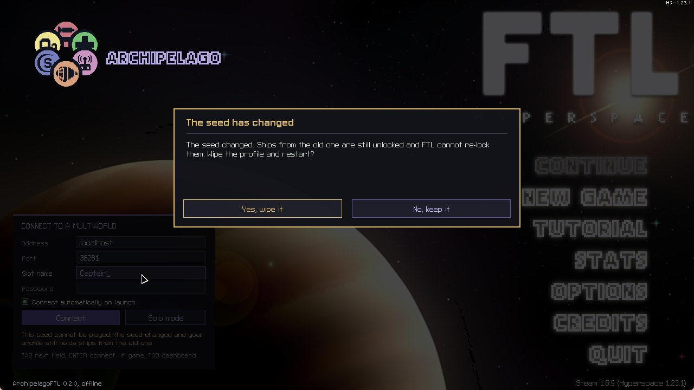
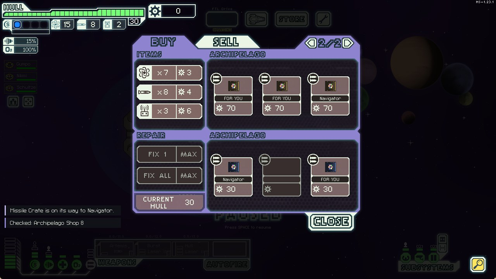
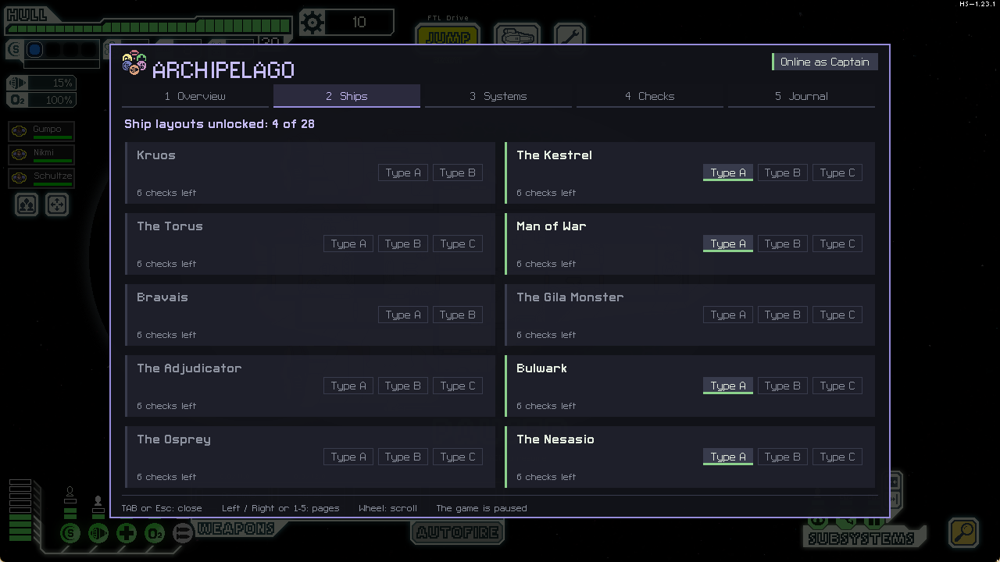
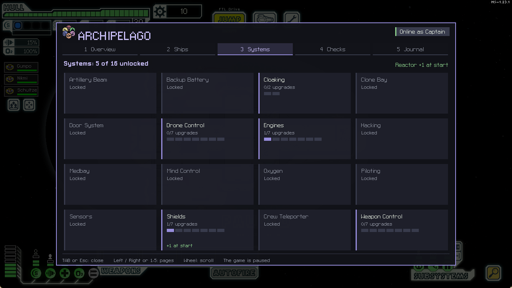
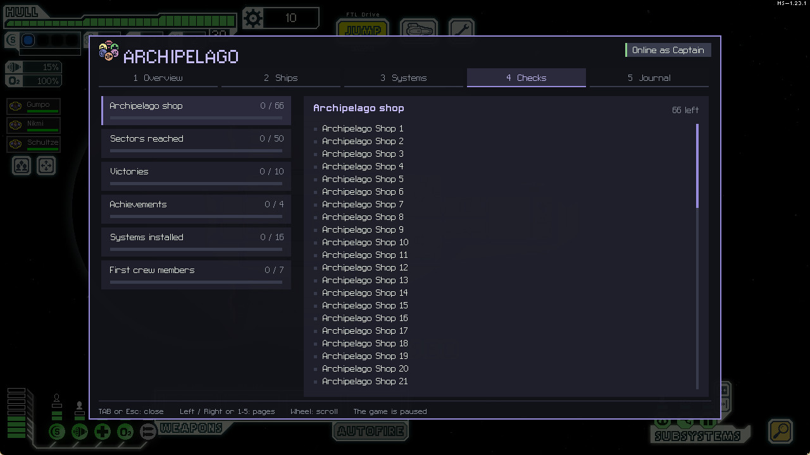
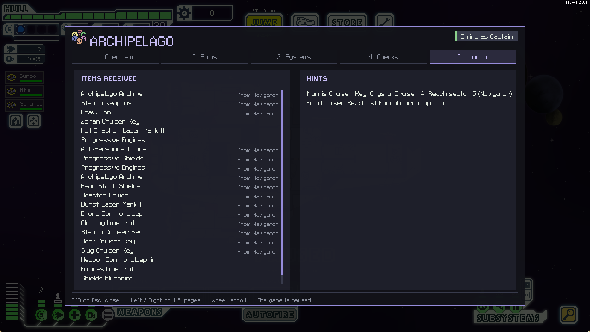

# Playing

## Connecting

On the main menu, fill in the panel at the bottom left: the server address (for example `archipelago.gg`), the
port, your slot name, and the password if the room has one. Press `Connect` or `ENTER`. `TAB` moves between
fields.

- The fields are remembered for next time. The password never is.
- Tick **Connect automatically on launch** and the mod reconnects every time FTL starts.
- If the connection drops, the mod tries again on its own.

Once connected, the panel shows your checks and a **Disconnect** button, and the goal appears at the top:

### "The seed has changed"

FTL can unlock a ship but never lock it again. So when you join a new seed with a profile that already played
another one, the mod asks first. **Yes** keeps a dated copy of the profile, wipes the Archipelago progress and
restarts FTL: the new seed starts clean. **No** keeps the old ships, which makes the new seed easier than it
should be.

## The hangar

Only the ships you own can be picked. The others stay locked until their key arrives, and new ships show up the
next time you are back in the hangar, never in the middle of a run. Type B and C layouts are items of their own.

## The start-of-run menu

Weapons and drones exist twice in the item pool, and crew members come in up to three steps. Once you have
received a second copy of something, a menu opens at the very start of each new run: pick **one weapon, one
drone and one crew member** from everything you have collected, and they come along for that run. Click
**Done** to close it, or just jump: the menu only stays until the first jump. If you quit the game before
choosing, it is still there when you continue.

It comes back at the start of every run, so a good second copy is worth something every time.

## During a run

What you receive arrives by itself, at the next quiet beacon if you are in a fight:

- a **ship key** or **layout**: in the hangar next time;
- a **system blueprint**: stores can now sell that system;
- a **Progressive** system item: one more upgrade level allowed;
- a **weapon or drone**, first copy: one is put on board (in the cargo hold if your slots are full) and it
  shows up more often in stores. Second copy: it joins the start-of-run menu;
- an **augment**: one is put on board and it shows up more often in stores;
- a **crew member**: the first joins your run, the second goes into the start-of-run menu, the third makes that
  menu entry an expert with one skill mastered;
- a **Head Start**: a free system level or reactor bar at the start of every future run;
- **filler** (scrap, fuel, missiles, drone parts) and, if the seed has them, **traps**.

Notes at the bottom left tell you what arrived and what was sent. They fade after a few seconds, and everything
is kept in the dashboard.

## ARCHIPELAGO beacons

Each sector has beacons marked **ARCHIPELAGO**. They hold either the Archipelago shop or one of four events.

### The Archipelago shop

Each package is an item from the multiworld. The name under it says who it is for; **FOR YOU** means one of your
own items. Buying a package sends it right away:

Filler costs 10 to 25 scrap, useful items 30 to 65, and important ones 70 to 150. A package that was sent never
comes back.

### The four events

- **A relay** carrying packages for other players. Pay 15 scrap to forward one.
- **A Zoltan checkpoint**, which asks for fuel for the shared Energy Link reserve, or a toll if Energy Link is off.
- **A Slug** who sells a real Archipelago hint for 20 scrap. If there is nothing left to hint, you get the scrap
  back.
- **A surge from another world**, which you can absorb or send away as a trap (with Trap Link on).

None of them can hide a check from you: they are extra, never required.

## The dashboard

Press `TAB` in a run. The game pauses while it is open. `Left`/`Right` or `1` to `5` change page, the mouse
wheel scrolls, `Esc` closes it.

| | |
|---|---|
|  |  |
| **Overview**: goal, checks per category, links, last items, hints. | **Ships**: which layouts you own, checks left per ship. |
|  |  |
| **Systems**: blueprints and upgrade levels received. | **Checks**: everything still to do, by category. |

**Journal**: every item received, who sent it, and the hints about your world.

## The goal

Beat the Flagship with a number of **different** ships (or layouts). The main menu and the dashboard say it in
full, for example "defeat the Flagship 2 times, a different ship for each victory", and list the ships you have
already won with. A second win with the same ship still sends that ship's victory check, it just does not
count again for the goal.

Some seeds also ask for **Archives**: items spread in the other players' worlds. You need both the victories and
enough Archives. The goal is sent on its own as soon as both are there, even if the last Archive arrives while
you sit in the menu.

Some seeds ask for Normal or Hard wins. An easier win still sends its check, but does not count for the goal.

## Solo mode

No server? Click **Solo mode** in the connection panel. It uses a real generated seed and gives you one of its
items per check. Your progress is saved in the profile, so you can stop and come back later. **Stop solo** puts
it aside, and clicking **Solo mode** again asks whether to continue or start over.

## Things worth knowing

- **Losing a run costs only the run.** Items stay, and Head Starts make the next run stronger.
- **A run started before you connected does not count.** Connect first, then start a new game. The same goes for
  a run saved under another seed: "Continue" brings it back, but it counts for nothing, and the scrap, fuel
  and traps you receive meanwhile wait for your next real run.
- **Coming back to a seed you played before** does not hand out its scrap, fuel and traps a second time. Ships,
  blueprints and upgrade levels come back as they were.
- **Achievement checks are sent at the next jump** after you earn them.
- **Received traps never destroy your ship.** They leave at least 3 hull and 2 fuel, and wait for a quiet beacon.
- **Received deaths** (Death Link) never take your last hull point or your last crew member.
- **You send a death** (Death Link) when you lose the run or a crew member, depending on the seed's options.
  Dismissing a crew member from the crew screen, or losing a drone, does not count.
