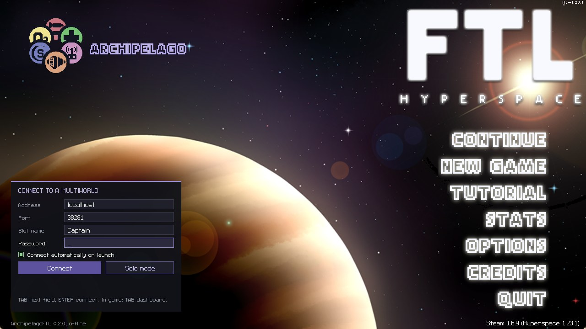

# Instalação no Linux

[English](Setup-Linux.md) · [Français](Setup-Linux.fr.md) · [Deutsch](Setup-Linux.de.md) ·
[Español](Setup-Linux.es.md) · [Italiano](Setup-Linux.it.md) · **Português**

*Esta página foi traduzida com IA e pode ter erros. Em caso de dúvida, vale a página em inglês.*

Para a versão nativa de Linux do FTL na Steam (1.6.13). Não rode o FTL pelo Proton para isso: a biblioteca de
Linux abaixo não carrega lá. Leva uns dez minutos.

## O que baixar

Coloque tudo na mesma pasta, por exemplo `Downloads`.

- Da [release do FTL Archipelago](https://github.com/TheLiloji/FTLArchipelago/releases/latest):
  `ArchipelagoFTL.ftl` e `Hyperspace.1.6.13.amd64.so`.
- Da [release do ftlman](https://github.com/afishhh/ftlman/releases/latest):
  `ftlman-x86_64-unknown-linux-gnu.tar.gz`.
- Da [release do Hyperspace 1.23.1](https://github.com/FTL-Hyperspace/FTL-Hyperspace/releases/tag/v1.23.1):
  `FTL.Hyperspace.1.23.1-Linux.zip`.

## 1. Proteger seus saves

Desative a **Steam Cloud** para o FTL (botão direito, Propriedades, Geral) e copie sua pasta de saves:

```sh
cp -r ~/.local/share/FasterThanLight ~/.local/share/FasterThanLight.backup
```

## 2. Descompactar

Abra um terminal na pasta dos downloads:

```sh
tar xzf ftlman-x86_64-unknown-linux-gnu.tar.gz
unzip FTL.Hyperspace.1.23.1-Linux.zip Hyperspace.ftl
cp Hyperspace.ftl ArchipelagoFTL.ftl ftlman/mods/
```

Agora você tem o ftlman em `ftlman/ftlman`, e os dois mods na pasta `mods` dele.

## 3. Instalar o Hyperspace e o mod

No mesmo terminal:

```sh
D=~/.steam/steam/steamapps/common/"FTL Faster Than Light"/data
ftlman/ftlman hyperspace-install 1.23.1 -d "$D"
ftlman/ftlman patch -d "$D" Hyperspace.ftl ArchipelagoFTL.ftl
```

`D` é a pasta do jogo que tem o `FTL.amd64`. Se o FTL estiver em outra biblioteca da Steam, mude essa primeira
linha.

Passe sempre os dois mods, o Hyperspace primeiro. O ftlman refaz os dados do jogo do zero a cada vez, então
aplicar só o `ArchipelagoFTL.ftl` tiraria o Hyperspace.

## 4. Colocar a biblioteca do Archipelago

Guarde a biblioteca oficial e coloque a do Archipelago no lugar dela:

```sh
cp "$D/Hyperspace.1.6.13.amd64.so" "$D/Hyperspace.1.6.13.amd64.so.official"
cp Hyperspace.1.6.13.amd64.so "$D/"
```

## 5. Iniciar o jogo

Inicie o FTL **pela Steam**, ou com o script `FTL` da pasta `data`. Abrir o `FTL.amd64` direto pula o
Hyperspace. Você deve ver:



- `HS-1.23.1 x64` no canto superior direito,
- o logo do Archipelago no canto superior esquerdo,
- um painel **Connect to a multiworld** no canto inferior esquerdo.

Se o painel não aparecer, ou a conexão nunca funcionar, veja o [FAQ](FAQ.md) (em inglês).

## Atualizar para uma versão nova

Coloque o novo `ArchipelagoFTL.ftl` em `ftlman/mods/`, rode de novo a linha `patch` do passo 3 e depois o passo
4 com o novo `Hyperspace.1.6.13.amd64.so`.

Próximo: [Jogar](Playing.md) (em inglês).
