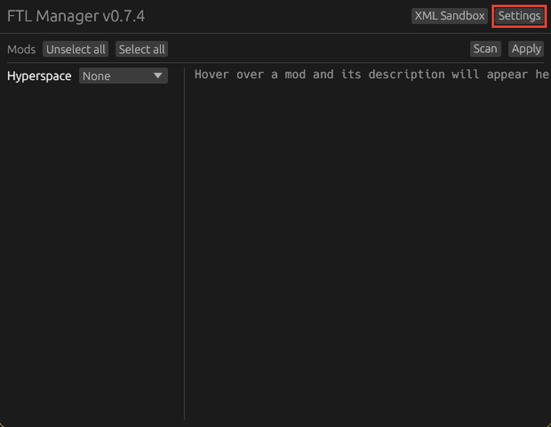
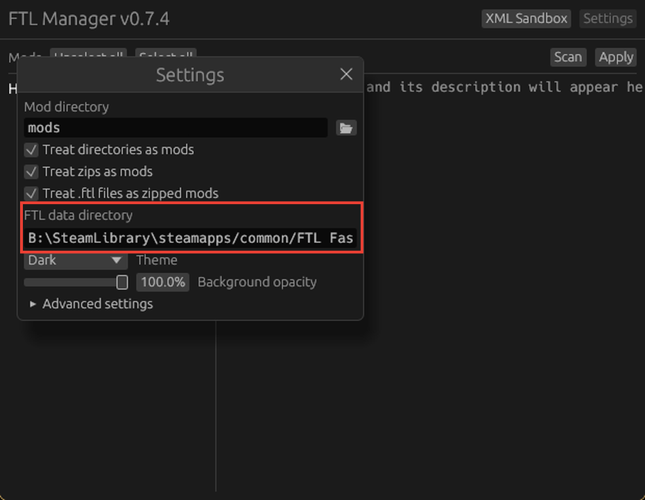
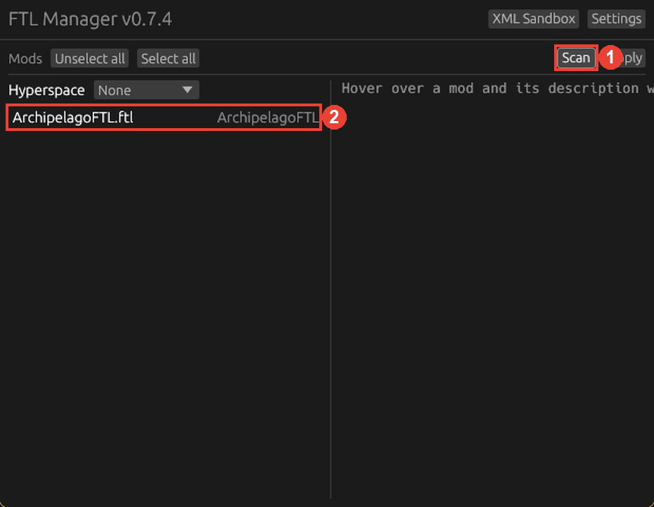
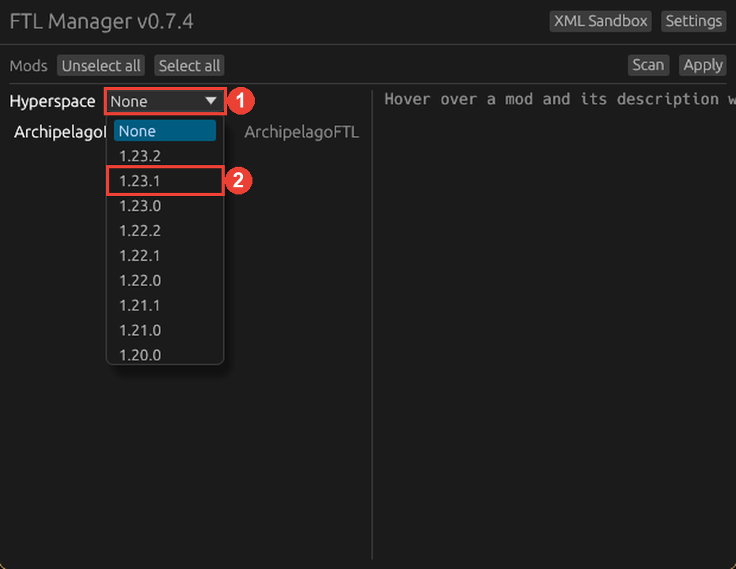
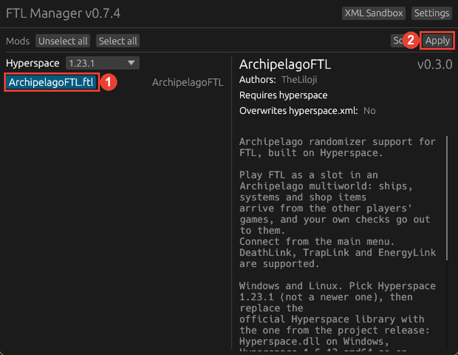

# Instalação no Windows

[English](Setup-Windows.md) · [Français](Setup-Windows.fr.md) · [Deutsch](Setup-Windows.de.md) · [Español](Setup-Windows.es.md) ·
[Italiano](Setup-Windows.it.md) · **Português**

*Esta página foi traduzida com IA e pode ter erros. Em caso de dúvida, vale a página em inglês.*

> [!WARNING]
> **Feche o FTL antes de começar** e deixe-o fechado até o último passo. O Windows bloqueia os arquivos do
> jogo enquanto o FTL está aberto, e a instalação falha sem avisar.

> [!IMPORTANT]
> No ftlman, escolha o **Hyperspace 1.23.1**, não uma versão mais nova. A biblioteca do Archipelago só serve
> para a 1.23.1.

## O que baixar

1. Da [release do FTL Archipelago](https://github.com/TheLiloji/FTLArchipelago/releases/latest):
   `ArchipelagoFTL.ftl` e `Hyperspace.dll`.
2. [ftlman](https://github.com/afishhh/ftlman/releases/latest): o zip para Windows. Descompacte numa pasta só
   dele, por exemplo `Documents\ftlman`.

É só isso: o ftlman baixa o Hyperspace sozinho.

## 1. Proteger seus saves

Na Steam, clique direito no FTL, **Propriedades**, **Geral**, e desative a **Steam Cloud**. Depois copie a pasta
`Documents\My Games\FasterThanLight` para um lugar seguro. O mod usa um perfil próprio, a cópia é só por
garantia.

## 2. Conferir a pasta do FTL no ftlman

Abra o `ftlman.exe` e clique em **Settings**:

**FTL data directory** deve apontar para a pasta do FTL, a que tem o `FTLGame.exe`. Normalmente o ftlman a
encontra sozinho. Se estiver vazia ou errada, abra a pasta pela Steam (clique direito no FTL, **Gerenciar**,
**Explorar arquivos locais**) e cole o caminho aqui. Feche a janela de configurações.

## 3. Adicionar o mod

Coloque o `ArchipelagoFTL.ftl` na pasta `mods` ao lado do `ftlman.exe` (crie a pasta se não existir). Clique em
**Scan** (1): o mod aparece na lista (2).

## 4. Escolher o Hyperspace 1.23.1

Abra o menu **Hyperspace** (1) e escolha **1.23.1** (2). Nem 1.23.2, nem "None".

## 5. Aplicar

Clique no mod até ele ficar azul (1), depois em **Apply** (2). Se o ftlman oferecer mudar o FTL para a versão
1.6.9, aceite: é a única versão do Windows em que o Hyperspace roda, e o jogo original fica guardado como
`FTLGame_orig.exe`. Espere o ftlman terminar e feche-o.

## 6. Colocar a biblioteca do Archipelago

> [!WARNING]
> **Faça isso depois do Apply, toda vez que clicar em Apply.** O Apply devolve a `Hyperspace.dll` oficial, e com
> ela o mod não consegue se conectar a um servidor.

Abra a pasta do FTL (na Steam: clique direito no FTL, **Gerenciar**, **Explorar arquivos locais**). Copie para ela
a `Hyperspace.dll` baixada da release do FTL Archipelago e escolha **Substituir o arquivo**.

## 7. Iniciar o jogo

Inicie o FTL pela Steam. No menu principal você deve ver o logo do Archipelago no canto superior esquerdo e um
painel **Ligar a um multiworld** no canto inferior esquerdo:

Se o painel não aparecer ou a conexão nunca funcionar, veja o [FAQ](FAQ.md) (em inglês).

## Atualizar para uma nova versão

Feche o FTL. Coloque o novo `ArchipelagoFTL.ftl` na pasta `mods` do ftlman, clique em **Apply** e copie de novo
a nova `Hyperspace.dll` para a pasta do FTL.

Próximo: [Playing](Playing.md) (em inglês).
